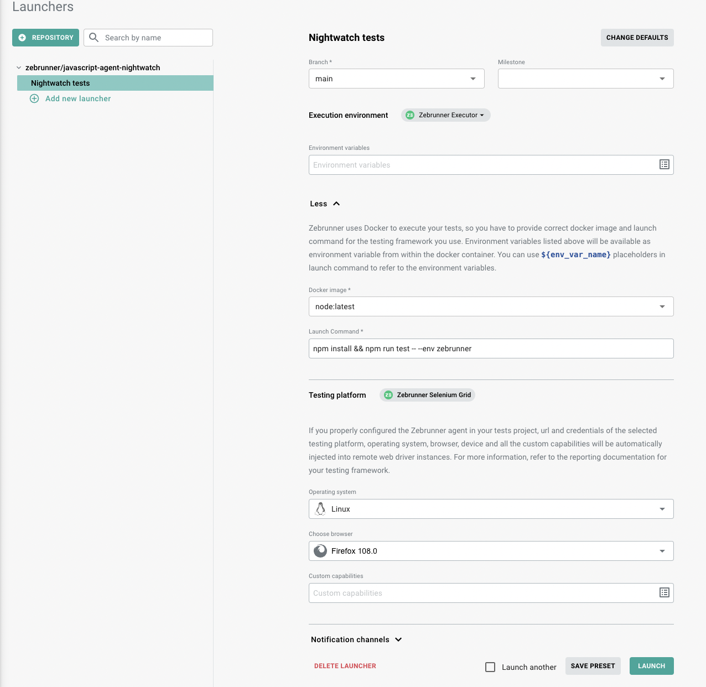

# Zebrunner Nightwatch reporting agent

The Nightwatch Agent supports and works with default Nightwatch and [Mocha](https://nightwatchjs.org/guide/writing-tests/using-mocha.html) runners so far.

Please refer to the appropriate section below to find more information about configuration.
- [Nightwatch runner](#reporter-setup---nightwatch-runner)
- [Mocha runner](#reporter-setup---mocha-runner)


## Inclusion into your project

### Adding dependency

First, you need to add the Zebrunner Agent into your `package.json` file by executing the following command:

```shell
npm install @zebrunner/javascript-agent-nightwatch
```

### Reporter setup - Nightwatch runner

The agent does not work automatically after adding it into the project, it requires extra configuration. For this, you need to perform the following steps:

1. Create a file with global hooks (in this example they are located in `lib/globals.js`) or open existing one if you already have it and configure Zebrunner reporting. 
Read more about [Nightwatch global hooks](https://nightwatchjs.org/guide/writing-tests/global-test-hooks.html).
- import `ZebrunnerReporter`, `ZebrunnerReporterAPI` from `@zebrunner/javascript-agent-nightwatch` package and configuration file of your project (`nightwatch.conf.js` by default).
- add `before`, `after`, `beforeEach` and `afterEach` hooks handlers (or update if already have it) to start and finish Zebrunner runs.

#### **`globals.js`**
   ```js
    const { ZebrunnerReporter, ZebrunnerReporterAPI } = require('@zebrunner/javascript-agent-nightwatch');
    const config = require('../nightwatch.conf')
    let zbrReporter;

    module.exports = {
        before: async () => {
            zbrReporter = new ZebrunnerReporter(config);
            await zbrReporter.startTestRun();
        },

        after: async () => {
            await zbrReporter.finishTestRun();
        },

        beforeEach: (browser, done) => {
            ZebrunnerReporterAPI.startTestSession(browser);
            done();
        },

        afterEach: (browser, done) => {
            ZebrunnerReporterAPI.finishTestSession(browser);
            done();
        },
    };
   ```
2. Navigate to your Nightwatch configuration file (by default, it is `nightwatch.conf.js`) and provide following information:
- the path with globals hooks for `globals_path` variable (in our case `lib/globals.js`);
- Zebrunner reporter configuration. You can find more information in the next section [Reporter configuration](#reporter-configuration);

#### **`nightwatch.conf.js`**
   ```js
   module.exports = {
        // ...
        src_folders: ["tests"],

        // path to file with Global hooks
        globals_path: "lib/globals.js", 
        // Zebrunner reporter configuration
        reporterOptions: {
            zebrunnerConfig: {
                enabled: true,
                projectKey: 'DEF',
                server: {
                    hostname: 'https://mycompany.zebrunner.com',
                    accessToken: 'somesecretaccesstoken'
                },
                run: {
                    displayName: "Nightly Regression",
                    build: '2.41.2.2431-SNAPSHOT',
                    environment: 'QA',
                },
                milestone: {
                    id: 1,
                    name: 'Release 1.0.0',
                },
                notifications: {
                    notifyOnEachFailure: false,
                    slackChannels: 'dev, qa',
                    teamsChannels: 'dev-channel, management',
                    emails: 'manager@mycompany.com',
                },
            }
        }
        // ...
   };
   ```
3. Update your *ALL* existing test files with one of the approach below depends on your needs.

NOTE: you can use only one approach within a test file, but different test files from one execution (test run) can use any of those options.

a. if you wish to track *all tests from the file as one test in Zebrunner*, use `before` and `after` hooks handlers to start and finish Zebrunner test as on examples below. You can define the second argument (`Your test name` in this case), if you want to see a custom name of the test. In case of absence, the agent will use test file name.

- Bdd syntax
   ```js
    const { ZebrunnerReporterAPI } = require("@zebrunner/javascript-agent-nightwatch");

    describe("Test Suite", function () {

        before((browser) => {
            ZebrunnerReporterAPI.startTest(browser, "Your test name");
            // or just
            // ZebrunnerReporterAPI.startTest(browser);
        });

        after((browser) => {
            ZebrunnerReporterAPI.finishTest(browser, "Your test name");
            // or just
            // ZebrunnerReporterAPI.finishTest(browser);
        });
    });
   ```
- Exports syntax
   ```js
    const { ZebrunnerReporterAPI } = require("@zebrunner/javascript-agent-nightwatch");

    module.exports = {

        before: function (browser) {
            ZebrunnerReporterAPI.startTest(browser, "Your test name");
            // or just
            // ZebrunnerReporterAPI.startTest(browser);
        },

        after: function (browser) {
            ZebrunnerReporterAPI.finishTest(browser, "Your test name");
            // or just
            // ZebrunnerReporterAPI.finishTest(browser);
        },
    }
   ```

b. if you wish to track tests in classic manner i.e. *each test from the file as separate test in Zebrunner*, use `beforeEach` and `afterEach` hooks handlers. The second optional argument will be used as prefix of all reported Zebrunner tests. Otherwise, the agent will use running test file name.

- Bdd syntax
   ```js
    const { ZebrunnerReporterAPI } = require("@zebrunner/javascript-agent-nightwatch");

    describe("Test Suite", function () {

        beforeEach((browser) => {
            ZebrunnerReporterAPI.startTest(browser, "Your test name that will be used as prefix");
            // or just
            // ZebrunnerReporterAPI.startTest(browser);
        });

        afterEach((browser) => {
            ZebrunnerReporterAPI.finishTest(browser, "Your test name that will be used as prefix");
            // or just
            // ZebrunnerReporterAPI.finishTest(browser);
        });
    });
   ```
- Exports syntax
   ```js
    const { ZebrunnerReporterAPI } = require("@zebrunner/javascript-agent-nightwatch");

    module.exports = {

        beforeEach: function (browser) {
            ZebrunnerReporterAPI.startTest(browser, "Your test name that will be used as prefix");
            // or just
            // ZebrunnerReporterAPI.startTest(browser);
        },

        afterEach: function (browser) {
            ZebrunnerReporterAPI.finishTest(browser, "Your test name that will be used as prefix");
            // or just
            // ZebrunnerReporterAPI.finishTest(browser);
        },
    }
   ```
c. if you want to track *all tests from the file as one test in Zebrunner* for all your files in the framework, use `beforeEach` and `afterEach` hooks handlers from `lib/globals.js`. In this case, configuration is mandatory only for this file with global hooks and *not* necessary to update each test file. 

NOTE: using this configuration, logs and screenshots of the test will be displayed in Zebrunner when a whole test file is finished.

#### **`globals.js`**
   ```js
    const { ZebrunnerReporter, ZebrunnerReporterAPI } = require('@zebrunner/javascript-agent-nightwatch');
    const config = require('../nightwatch.conf')
    let zbrReporter;

    module.exports = {
        before: async () => {
            zbrReporter = new ZebrunnerReporter(config);
            await zbrReporter.startTestRun();
        },

        after: async () => {
            await zbrReporter.finishTestRun();
        },

        beforeEach: (browser, done) => {
            ZebrunnerReporterAPI.startTestSession(browser);
            ZebrunnerReporterAPI.startTest(browser);
            done();
        },

        afterEach: (browser, done) => {
            ZebrunnerReporterAPI.finishTest(browser);
            ZebrunnerReporterAPI.finishTestSession(browser);
            done();
        },
    };
   ```

### Reporter setup - Mocha runner

The agent does not work automatically after adding it into the project, it requires extra configuration. For this, you need to perform the following steps:

1. Navigate to your Nightwatch configuration file (by default, it is `nightwatch.conf.js`)
2. Since the agent works with Mocha as test runner in Nightwatch, it is necessary to set the `test_runner` config property and set the type to `mocha`. Make sure that `ui` option reflects correct style used by your tests (`bdd`, `tdd` etc.). 
3. Add `@zebrunner/javascript-agent-nightwatch` as a reporter inside custom Mocha options and provide the reporter configuration (you can find more about that in the next section). Here is an example of a configuration snippet:

#### **`nightwatch.conf.js`**
   ```js
   module.exports = {
        // ...
        test_settings: {
            default: {
                test_runner: {
                    type: 'mocha',
                    options: {
                        ui: 'bdd',
                        reporter: "@zebrunner/javascript-agent-nightwatch",
                        reporterOptions: {
                            zebrunnerConfig: {
                            // Zebrunner reporter configuration
                            },
                        },
                    },
                },
                // other configs
            },
        },
        // ...
   };
   ```

## Reporter configuration

Once the agent is added into your project, it is **not** automatically enabled. The valid configuration must be provided first.

It is currently possible to provide the configuration via:

1. Environment variables
2. `nightwatch.conf.js` file

The configuration lookup will be performed in the order listed above, meaning that environment configuration will always take precedence over `nightwatch.conf.js` file. As a result, it is possible to override configuration parameters by passing them through a configuration mechanism with higher precedence.

### Configuration options

The following subsections contain tables with configuration options. The first column in these tables contains the name of the option. It is represented as an environment variable (the first value) and as a reporter config property from `nightwatch.conf.js` file (the second value). The second column contains description of the configuration option.

#### Common configuration

| Env var / Reporter config                                | Description                                                                                                                                                                         |
| -------------------------------------------------------- | ----------------------------------------------------------------------------------------------------------------------------------------------------------------------------------- |
| `REPORTING_ENABLED`<br/>`enabled`                        | Enables or disables reporting. The default value is `false`.                                                                                                                        |
| `REPORTING_PROJECT_KEY`<br/>`projectKey`                 | Optional value. It is the key of Zebrunner project that the launch belongs to. The default value is `DEF`.                                                                          |
| `REPORTING_SERVER_HOSTNAME`<br/>`server.hostname`        | Mandatory if reporting is enabled. It is your Zebrunner hostname, e.g. `https://mycompany.zebrunner.com`.                                                                           |
| `REPORTING_SERVER_ACCESS_TOKEN`<br/>`server.accessToken` | Mandatory if reporting is enabled. The access token is used to perform API calls. It can be obtained in Zebrunner on the 'Account and profile' page under the 'API Tokens' section. |

#### Automation launch configuration

The following configuration options allow you to configure accompanying information that will be displayed in Zebrunner for the automation launch.

| Env var / Reporter config                          | Description                                                                                                                             |
| -------------------------------------------------- | --------------------------------------------------------------------------------------------------------------------------------------- |
| `REPORTING_RUN_DISPLAY_NAME`<br/>`run.displayName` | Display name of the launch in Zebrunner. The default value is `Default Suite`.                                                          |
| `REPORTING_RUN_BUILD`<br/>`run.build`              | Build number associated with the launch. It can reflect either the test build number or the build number of the application under test. |
| `REPORTING_RUN_ENVIRONMENT`<br/>`run.environment`  | Represents the target environment in which the tests were run. For example, `stage` or `prod`.                                          |

#### Milestone

Zebrunner Milestone for the automation launch can be configured using the following configuration options (all of them are optional).

| Env var / Reporter config                       | Description                                                                                                                                                                                                                         |
|-------------------------------------------------|-------------------------------------------------------------------------------------------------------------------------------------------------------------------------------------------------------------------------------------|
| `REPORTING_MILESTONE_ID`<br/>`milestone.id`     | Id of the Zebrunner Milestone to link the automation launch to. The id is not displayed on Zebrunner UI, so the field is basically used for internal purposes. If the milestone does not exist, the launch will continue executing. |
| `REPORTING_MILESTONE_NAME`<br/>`milestone.name` | Name of the Zebrunner Milestone to link the automation launch to. If the milestone does not exist, the appropriate warning message will be displayed in logs, but the test suite will continue executing.                           |

#### Notifications

Zebrunner provides notification capabilities for automation launch results. The following options configure notification rules and targets.

| Env var / Reporter config                                                               | Description                                                                                                                                                                                                                                                                                                                                                              |
|-----------------------------------------------------------------------------------------|--------------------------------------------------------------------------------------------------------------------------------------------------------------------------------------------------------------------------------------------------------------------------------------------------------------------------------------------------------------------------|
| `REPORTING_NOTIFICATION_NOTIFY_ON_EACH_FAILURE`<br/>`notifications.notifyOnEachFailure` | Specifies whether Zebrunner should send notifications to Slack/Teams on each test failure. The notifications will be sent even if the launch is still running. The default value is `false`.                                                                                                                                                                             |
| `REPORTING_NOTIFICATION_SLACK_CHANNELS`<br/>`notifications.slackChannels`               | A comma-separated list of Slack channels to send notifications to. Notifications will be sent only if the Slack integration is properly configured in Zebrunner with valid credentials for the project the launch is reported to. Zebrunner can send two types of notifications: on each test failure (if the appropriate property is enabled) and on the launch finish. |
| `REPORTING_NOTIFICATION_MS_TEAMS_CHANNELS`<br/>`notifications.teamsChannels`            | A comma-separated list of Microsoft Teams channels to send notifications to. Notifications will be sent only if the Teams integration is configured in the Zebrunner project with valid webhooks for the channels. Zebrunner can send two types of notifications: on each test failure (if the appropriate property is enabled) and on the launch finish.                |
| `REPORTING_NOTIFICATION_EMAILS`<br/>`notifications.emails`                              | A comma-separated list of emails to send notifications to. This type of notifications does not require further configuration on Zebrunner side. Unlike other notification mechanisms, Zebrunner can send emails only on the launch finish.                                                                                                                               |

### Examples

=== "Environment Variables"

The following code snippet is a list of all configuration environment variables from `.env` file:

   ```text
    REPORTING_ENABLED=true
    REPORTING_PROJECT_KEY=DEF
    REPORTING_SERVER_HOSTNAME=https://mycompany.zebrunner.com
    REPORTING_SERVER_ACCESS_TOKEN=somesecretaccesstoken

    REPORTING_RUN_DISPLAY_NAME=Nightly Regression
    REPORTING_RUN_BUILD=2.41.2.2431-SNAPSHOT
    REPORTING_RUN_ENVIRONMENT=QA

    REPORTING_MILESTONE_ID=1
    REPORTING_MILESTONE_NAME=Release 1.0.0

    REPORTING_NOTIFICATION_NOTIFY_ON_EACH_FAILURE=false
    REPORTING_NOTIFICATION_SLACK_CHANNELS=dev, qa
    REPORTING_NOTIFICATION_MS_TEAMS_CHANNELS=dev-channel, management
    REPORTING_NOTIFICATION_EMAILS=manager@mycompany.com

   ```

=== "`nightwatch.conf.js` file"

Here you can see an example of the full configuration provided via `nightwatch.conf.js` file:

   ```js
    // ...
    reporterOptions: {
        zebrunnerConfig: {
            enabled: true,
            projectKey: 'DEF',
            server: {
                hostname: 'https://mycompany.zebrunner.com',
                accessToken: 'somesecretaccesstoken'
            },
            run: {
                displayName: "Nightly Regression",
                build: '2.41.2.2431-SNAPSHOT',
                environment: 'QA',
            },
            milestone: {
                id: 1,
                name: 'Release 1.0.0',
            },
            notifications: {
                notifyOnEachFailure: false,
                slackChannels: 'dev, qa',
                teamsChannels: 'dev-channel, management',
                emails: 'manager@mycompany.com',
            },
        }
    }
    // ...
   ```

## Configuration for Zebrunner Launcher
The Nightwatch Agent is fully integrated with the Zebrunner Launcher and requires even less configuration when used with it. The Zebrunner Launcher automatically provides REPORTING_ENABLED, REPORTING_PROJECT_KEY, REPORTING_SERVER_HOSTNAME, REPORTING_SERVER_ACCESS_TOKEN and some other environment variables, so there is no need to explicitly specify them or the corresponding `nightwatch.conf.js` file properties. 

### Testing Platform and capabilities
Moreover, the Zebrunner Agent will automatically substitute the Selenium server and capabilities configurations with the values selected in Testing Platform section in Zebrunner Launcher. For example, if you select Zebrunner Selenium Grid as a testing platform and select the Linux platform and the Chrome 105.0 browser, the Zebrunner Agent will apply the following configuration on your `nightwatch.conf.js` file. 

Only necessary to import `ZebrunnerConfigurator` and add a new environment that calls `ZebrunnerConfigurator.configureLauncher` function with basic config object of the following structure (please see below) into `nightwatch.conf.js` configuration file. 
Learn more about [Nightwatch environments](https://nightwatchjs.org/guide/configuration/define-test-environments.html).

When configuration below is added, you will be able to execute the tests against this environment using the command `npx nightwatch tests/ --env zebrunner` or `npm run test -- --env zebrunner` - depends on your `package.json` scripts section configuration.

*NOTE*: this environment can be used in 2 ways:
- using Zebrunner Launcher: in this case Zebrunner Agent will automatically substitute the Selenium server and capabilities according to provided information on Launchers page:
.

- start running the tests locally, but using remote browsers with Zebrunner Selenium Grid: in this case you should provide valid Selenium information for host, port, username and access_key fields.


#### **`nightwatch.conf.js`**
   ```js
    const { ZebrunnerConfigurator } = require('@zebrunner/javascript-agent-nightwatch');

    module.exports = {

        // ...
        test_settings: {
            default: {
                screenshots: {
                    enabled: true,
                    path: 'screens',
                    on_failure: true,
                    on_error: true,
                },
            },

            // `zebrunner` environment should be defined on the same level as `default` environment
            zebrunner: ZebrunnerConfigurator.configureLauncher({
                selenium: {
                    start_process: false,
                    server_path: '',
                    host: 'localhost',
                    port: 4444,
                },

                username: 'username',
                access_key: 'access_key',

                webdriver: {
                    start_process: false,
                },
                desiredCapabilities: {
                    browserName: 'chrome',
                    'goog:chromeOptions': {
                        w3c: true,
                    },
                    "zebrunner:provider": "BROWSERSTACK"
                },
            }),
            // ...
        },
    };
   ```

## Executing tests using external testing platforms

While executing tests using external testing platforms (Browser Stack, Sauce Labs etc.), it is necessary to define one more Zebrunner capability `zebrunner:provider` in order to track test sessions and their artifacts (such as video) correctly.
Possible values:  "ZEBRUNNER" | "BROWSERSTACK" | "LAMBDATEST" | "SAUCELABS" | "TESTINGBOT".

#### **`nightwatch.conf.js`**
   ```js
    module.exports = {
        // ...
        desiredCapabilities: {
            browserName: "chrome",
            "goog:chromeOptions": {
                w3c: true,
            },
            "zebrunner:provider": "BROWSERSTACK"
        },
        // ...
   };
   ```

## Screenshots

In order to view screenshots taken on failed test in Zebrunner, make sure you enabled them in `nightwatch.conf.js` configuration file:

#### **`nightwatch.conf.js`**
   ```js
    module.exports = {
        // ...
        test_settings: {
            default: {
                screenshots: {
                    enabled: true,
                    path: "screens",
                    on_failure: true,
                    on_error: true,
                },
            },
        },
        // ...
   };
   ```
